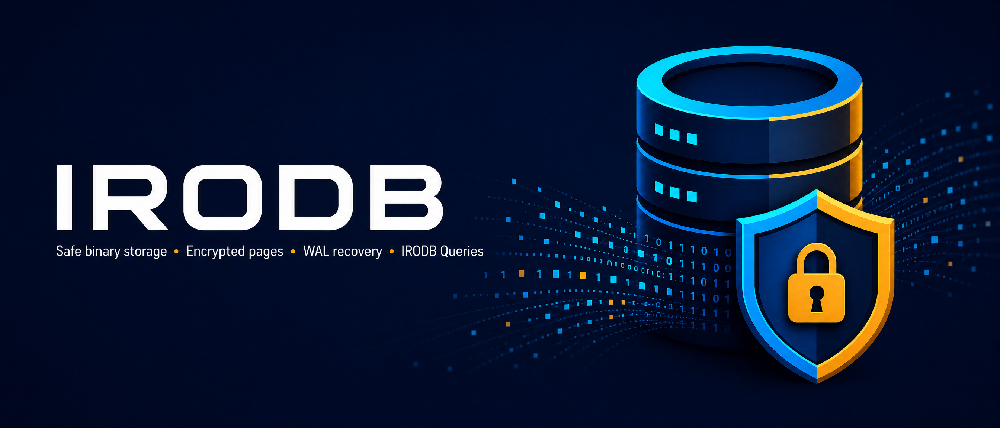

# IRODB



**Current release: v0.3.0**

Check the installed CLI version at any time:

```bash
irodb --version
# irodb 0.3.0
```

**IRODB** is a small, local database library for Python applications. It stores structured data in a single `.irodb` file, does not require a database server, and provides a simple Python API for creating tables, inserting rows, searching data, updating records, and deleting records.

IRODB also includes optional authenticated encryption. If encryption is enabled, database pages are protected with AES-GCM through the Python `pycryptodome` package, which does not require Rust. Existing environments that already have `cryptography` can use it as a compatibility fallback. Encryption is optional: you can use IRODB normally without an encryption key, or provide a key when creating and opening a database. The custom IRB2 binary codec rejects unsupported objects and hostile payloads during parsing, so database files are never passed to pickle or arbitrary object loading.

## Why use IRODB?

IRODB is designed for projects that need local structured storage without operating PostgreSQL, MySQL, or another external database service. It is suitable for prototypes, desktop tools, scripts, utilities, small services, tests, and applications that need a portable database file.

| Feature | What it means |
| --- | --- |
| Local and simple | Store data in a `.irodb` file without a database server. |
| Python API | Work with tables and rows directly from Python. |
| Custom binary format | Database pages are not plain text and do not use pickle for persistence. |
| Optional encryption | Protect pages with authenticated AES-GCM encryption through PyCryptodome without Rust. |
| Crash protection | A Python write-ahead log helps recover page writes after an interrupted process. |
| Integrity checks | Rows receive SHA-256 hashes that can be verified later. |
| IRODB Queries | Use a small parameterized query language that is simpler than SQL. |
| CLI support | Create, inspect, query, insert, update, and delete data from the terminal. |

## Install

Install the package from PyPI:

```bash
python -m pip install irotechlab-irodb
```

The `pycryptodome` encryption dependency is installed automatically because IRODB uses it for authenticated AES-GCM encryption. The optional `legacy-crypto` extra keeps compatibility with environments that already use `cryptography`.

To install the development version from source:

```bash
git clone https://github.com/IROTECHLAB/irodb.git
cd irodb
python -m pip install -e '.[dev]'
```

### Termux and Android installation

IRODB uses PyCryptodome for AES-GCM, so the normal encryption path does **not** require Rust. On Termux, install the Python package and IRODB normally:

```bash
pkg update
pkg upgrade
pkg install python
python -m pip install --upgrade pip
python -m pip install irotechlab-irodb
python -c "from irodb.encryption import backend_name; print(backend_name())"
```

The expected backend is `pycryptodome`. If your Termux repository provides a native PyCryptodome package, you can install it with `pkg search cryptodome` and use that package before installing IRODB. If pip cannot find a compatible Android wheel, PyCryptodome may still need the Termux C compiler; this is a C build, not a Rust build.

Existing installations can opt into the old backend with:

```bash
python -m pip install 'irotechlab-irodb[legacy-crypto]'
```

IRODB deliberately does not implement its own cipher. A home-made encryption algorithm would not have the review, test coverage, nonce handling, authentication guarantees, or cryptanalysis of established libraries. PyCryptodome's AES-GCM implementation is the recommended no-Rust backend; `cryptography` remains a compatibility fallback only.

## First example

The following example creates a database, creates a table, inserts a row, reads it, updates it, and closes the database safely.

```python
from irodb import IRODB


db = IRODB("people.irodb")
try:
    db.create_table("people", {
        "name": str,
        "age": int,
        "email": str,
    })

    db.insert("people", {
        "name": "Alice",
        "age": 30,
        "email": "alice@example.com",
    })

    adults = db.select("people", {"age": {"$gte": 18}})
    print(adults)

    db.update("people", {"name": "Alice"}, {"age": 31})
    db.delete("people", {"name": "Alice"})
finally:
    db.close()
```

When using a table name repeatedly, check whether it already exists before calling `create_table`, or open a new database file for the example.

## Tables and schemas

A table schema maps each field name to a Python type:

```python
from irodb import IRODB


db = IRODB("shop.irodb")
db.create_table("products", {
    "name": str,
    "price": float,
    "quantity": int,
    "available": bool,
}, enable_hash_index=True)
db.close()
```

Supported common field types include `str`, `int`, `float`, and `bool`. Fields may also contain `None`. A value with the wrong type is rejected before it is written.

## CRUD operations

IRODB uses four straightforward operations:

```python
# Insert one row.
row_id = db.insert("products", {
    "name": "Keyboard",
    "price": 49.99,
    "quantity": 10,
    "available": True,
})

# Read all rows.
rows = db.select("products")

# Read rows using conditions.
rows = db.select("products", {"price": {"$lt": 100}})

# Update matching rows.
changed = db.update("products", {"name": "Keyboard"}, {"quantity": 9})

# Delete matching rows.
removed = db.delete("products", {"available": False})
```

The Python condition operators include `$gt`, `$gte`, `$lt`, `$lte`, `$ne`, `$in`, and `$contains`.

### Fast bulk inserts

For imports and ingestion workloads, use `bulk_insert()` instead of calling `insert()` thousands of times. IRODB validates every row, updates the hash index, and commits the changed pages through one WAL record group and one filesystem synchronization:

```python
rows = [
    {"name": f"user-{number}", "age": number % 80, "email": f"user-{number}@example.com"}
    for number in range(10_000)
]
ids = db.bulk_insert("users", rows)
```

Single-row `insert()` remains the safest choice when each row must become durable immediately. `bulk_insert()` is the smoother and much faster choice when a group of rows can be committed together.

## Compact binary storage and controlled serialization

IRODB writes a compact IRB2 binary format instead of pickle or JSON. It uses variable-length framing, deterministic dictionary ordering, bounded page decoding, and a strict allowlist of supported values. Unsupported Python objects, unknown type markers, oversized lengths, excessive nesting, and hostile collection sizes are rejected before the value is returned. Existing IRB1 database pages remain readable for compatibility.

The benchmark for constrained devices is available as:

```bash
python benchmark_codec_android.py
```

It reports encoded size, bytes per record, encode/decode time, and peak traced memory. Run it on the target Android or low-RAM device for deployment-specific measurements.

## Optional encryption

Encryption is **optional**. If you do not provide `encryption_key`, IRODB creates a normal custom-binary database. If you provide an encryption key, IRODB encrypts database pages with authenticated AES-GCM using PyCryptodome. An existing installation with only `cryptography` can use the compatibility fallback.

The encryption key is not stored in the `.irodb` file. You must provide the same key every time you open the encrypted database. If the key is missing or incorrect, IRODB refuses to open the database.

### Encryption in Python code

Pass an encryption key when creating the database:

```python
from irodb import IRODB


key = "use-a-long-secret-passphrase-from-your-secret-manager"
db = IRODB("private.irodb", encryption_key=key)
try:
    if "notes" not in db.tables:
        db.create_table("notes", {"title": str, "body": str})
    db.insert("notes", {"title": "Private", "body": "Encrypted content"})
finally:
    db.close()
```

Open the same encrypted database by providing the same key:

```python
from irodb import IRODB


key = "use-a-long-secret-passphrase-from-your-secret-manager"
db = IRODB("private.irodb", auto_create=False, encryption_key=key)
try:
    print(db.select("notes"))
finally:
    db.close()
```

Do not hard-code a real production key in source code. The example uses a string only to show the API. In a real application, read the key from a secret manager or a protected environment variable:

```python
import os
from irodb import IRODB


key = os.environ["IRODB_KEY"]
db = IRODB("private.irodb", encryption_key=key)
```

### Encryption from the CLI

The CLI reads the encryption key from the `IRODB_KEY` environment variable by default. This keeps the secret out of the command itself and reduces the chance that it will appear in shell history or process listings.

Create or open an encrypted database:

```bash
export IRODB_KEY='use-a-long-secret-passphrase'
python -m irodb.cli private.irodb --create --dump-binary
```

Use the encrypted database:

```bash
export IRODB_KEY='use-a-long-secret-passphrase'
python -m irodb.cli private.irodb --table notes --insert-json '{"title":"Private","body":"Encrypted content"}'
python -m irodb.cli private.irodb --table notes --select
python -m irodb.cli private.irodb --query "IRODB GET notes"
```

If you use another environment-variable name, pass it with `--key-env`:

```bash
export PRIVATE_DATABASE_KEY='use-a-long-secret-passphrase'
python -m irodb.cli private.irodb --key-env PRIVATE_DATABASE_KEY --table notes --select
```

### Change an existing database passphrase

Use `--rekey` to change the passphrase of an existing encrypted database. The current passphrase is read from `IRODB_KEY`; the replacement passphrase is read from `IRODB_NEW_KEY`:

```bash
export IRODB_KEY='your-current-passphrase'
export IRODB_NEW_KEY='your-new-passphrase'
python -m irodb.cli private.irodb --rekey
```

IRODB re-encrypts one fixed-size page at a time, keeps memory usage bounded, prints progress, and validates the replacement before atomically installing it. If the operation fails, the original database remains in place. For custom variable names, use `--key-env` and `--new-key-env`:

```bash
export CURRENT_DB_KEY='your-current-passphrase'
export NEXT_DB_KEY='your-new-passphrase'
python -m irodb.cli private.irodb --rekey --key-env CURRENT_DB_KEY --new-key-env NEXT_DB_KEY
```

Do not put passphrases directly in command arguments. A shell variable can still be exposed by careless system configuration. For production deployments, prefer a secret manager, protected service environment, or operating-system credential store.

> Encryption protects confidentiality and detects tampering, but it does not replace backups, access control, or secure key management. Anyone who obtains the key can open the database.

## IRODB Queries

IRODB Queries are the recommended query interface. They are intentionally simpler than SQL and use named parameters for values. Every statement starts with `IRODB`.

```python
from irodb import IRODB


db = IRODB("query-example.irodb")
try:
    db.query("IRODB CREATE users SCHEMA name:text, age:int")
    db.query(
        "IRODB INSERT users VALUES name=:name, age=:age",
        {"name": "Alice", "age": 30},
    )

    rows = db.query(
        "IRODB GET users WHERE age >= :minimum ORDER age DESC LIMIT 10",
        {"minimum": 18},
    )
    print(rows)

    db.query(
        "IRODB UPDATE users SET age=:age WHERE name=:name",
        {"age": 31, "name": "Alice"},
    )
finally:
    db.close()
```

The available commands are:

| Command | Example |
| --- | --- |
| Create a table | `IRODB CREATE users SCHEMA name:text, age:int` |
| Insert a row | `IRODB INSERT users VALUES name=:name, age=:age` |
| Read rows | `IRODB GET users WHERE age >= :minimum LIMIT 10` |
| Update rows | `IRODB UPDATE users SET age=:age WHERE name=:name` |
| Delete rows | `IRODB DELETE users WHERE name=:name` |
| Drop a table | `IRODB DROP users` |

### Query safety

Values supplied through parameters are treated as data. They are not pasted into the query, interpreted as Python, or executed as SQL. For example, this input remains an ordinary name:

```python
rows = db.query(
    "IRODB GET users WHERE name=:name",
    {"name": "Alice' OR 1=1 --"},
)
```

IRODB Query does not accept arbitrary free-form query fragments. This design prevents IRODB injection by construction. Applications must still perform normal authorization and business validation.

## Command-line usage

Show information about a database:

```bash
python -m irodb.cli data.irodb --info
```

Run an IRODB Query:

```bash
python -m irodb.cli data.irodb --query "IRODB GET users WHERE age >= :minimum"
```

The CLI row-editing commands use JSON only as a command-line input format. JSON is not used for database persistence:

```bash
python -m irodb.cli data.irodb --table users --insert-json '{"name":"Bob","age":25}'
python -m irodb.cli data.irodb --table users --select
python -m irodb.cli data.irodb --table users --where-json '{"name":"Bob"}' --update-json '{"age":26}'
python -m irodb.cli data.irodb --table users --where-json '{"name":"Bob"}' --delete
```

Interactive mode accepts IRODB Query statements:

```bash
python -m irodb.cli data.irodb --interactive
```

## Integrity and crash recovery

The optimized writer batches related table, index, and metadata pages into one durable WAL commit. This reduces repeated WAL file opens and filesystem synchronization while preserving recovery semantics.

Each row receives a SHA-256 hash. Verify rows after opening a database:

```python
result = db.verify_hash_integrity("users")
print(result["valid_hashes"])
print(result["invalid_hashes"])
```

Before a page is written, IRODB records the complete page in `<database>.wal`. The log uses checksums and filesystem synchronization. If the application stops during a page write, the next open can replay complete WAL records. The WAL improves crash safety but does not replace regular backups.

## Examples

The repository includes runnable examples in [`examples/`](examples/):

| Example | Description |
| --- | --- |
| `basic_usage.py` | Basic Python CRUD operations. |
| `encrypted_wal.py` | Encrypted database pages and WAL-backed reopening. |
| `irodb_queries.py` | IRODB Query syntax and named parameters. |
| `sql_queries.py` | Legacy SQLParser compatibility example. |

## Testing

Install development dependencies and run the test suite:

```bash
python -m pip install -e '.[dev]'
python -m pytest -q
```

The tests cover CRUD operations, schemas, custom binary storage, encryption, wrong-key handling, tamper detection, WAL replay, IRODB Query parsing, injection-shaped input, bulk inserts, hashing, indexes, utilities, and CLI behavior. The repository also includes `benchmark_production.py` for reproducible plain-versus-encrypted single-row and bulk-write measurements.

## Project structure

```text
irodb/
  core.py             Database API and page management
  binary_codec.py    Custom typed binary format
  encryption.py      AES-GCM backend selection and authenticated encryption
  wal.py             Write-ahead logging and recovery
  feature_query.py   IRODB Query parser
  feature_sql.py     Legacy SQLParser compatibility layer
  cli.py             Command-line interface
examples/             Runnable examples
tests/                Automated tests
docs/                 README images and diagrams
```

## License

IRODB is released under the MIT License. See [LICENSE](LICENSE).

## Links

- [GitHub repository](https://github.com/IROTECHLAB/irodb)
- [PyPI package](https://pypi.org/project/irotechlab-irodb/)
- [Issue tracker](https://github.com/IROTECHLAB/irodb/issues)
